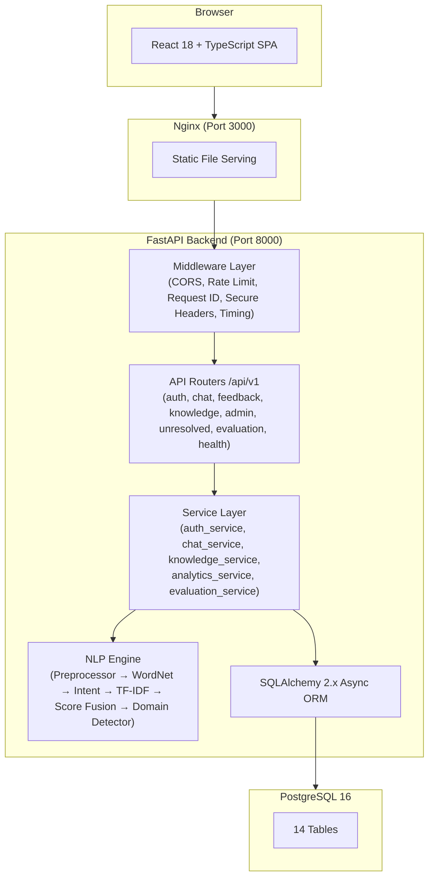
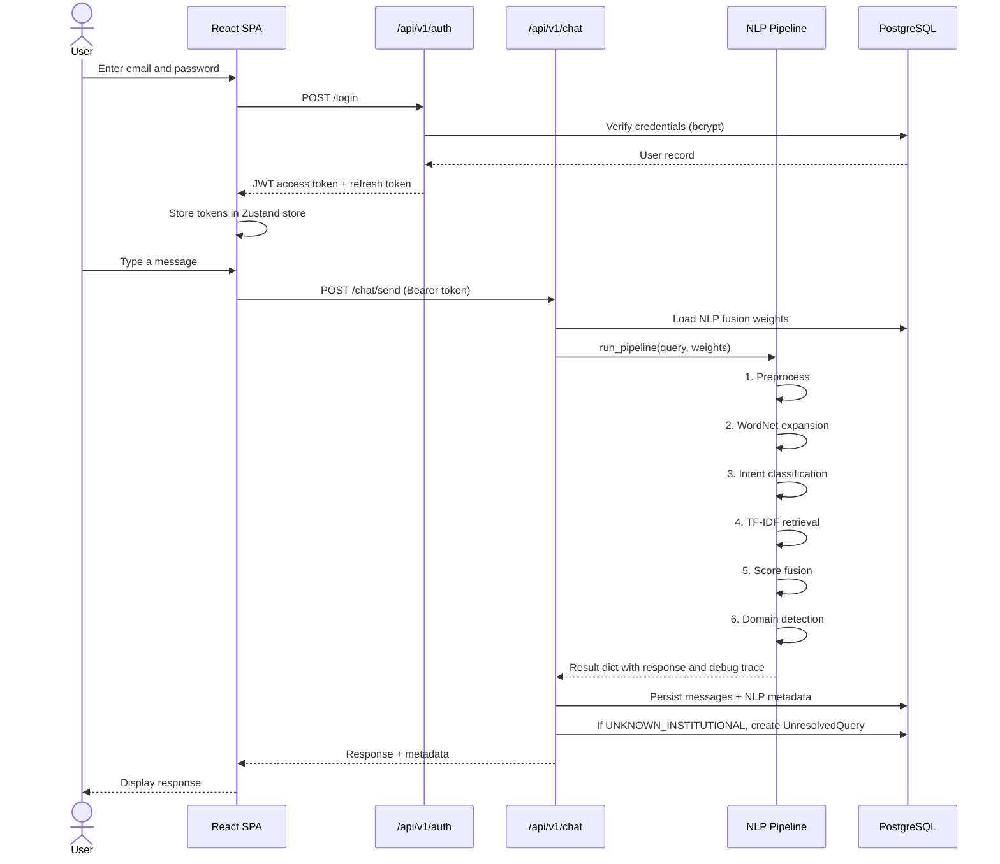
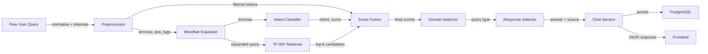
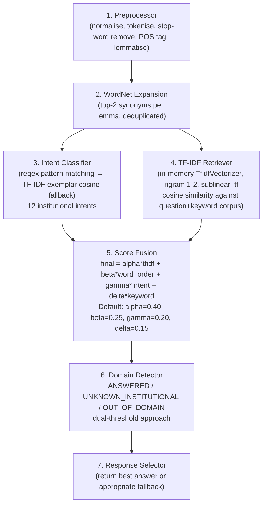
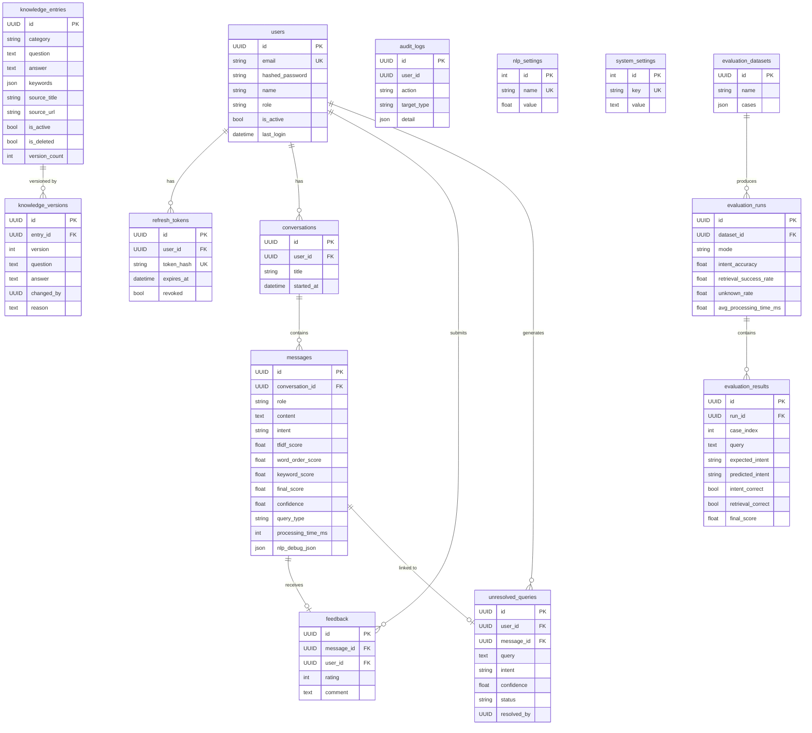
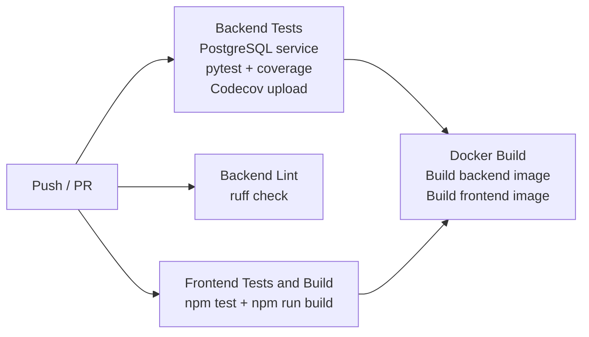

# Smart College AI Chatbot

> A production-ready, full-stack intelligent virtual assistant for college institutions — built with a custom multi-signal NLP pipeline, a React admin panel, JWT authentication, and a fully containerised deployment stack.


**Created and Built by Anand D**

---

## Table of Contents

- [Project Overview](#project-overview)
- [Problem Statement](#problem-statement)
- [Why This Project Was Created](#why-this-project-was-created)
- [Purpose](#purpose)
- [Objectives](#objectives)
- [Key Features](#key-features)
- [Use Cases](#use-cases)
- [Target Users](#target-users)
- [Benefits](#benefits)
- [System Architecture](#system-architecture)
- [System Workflow](#system-workflow)
- [Data Flow](#data-flow)
- [Component Architecture](#component-architecture)
- [NLP Pipeline (AI Engine)](#nlp-pipeline-ai-engine)
- [Technology Stack](#technology-stack)
- [Project Structure](#project-structure)
- [Database](#database)
- [API Documentation](#api-documentation)
- [Authentication & Authorization](#authentication--authorization)
- [Security](#security)
- [Installation](#installation)
- [Environment Variables](#environment-variables)
- [Running the Project](#running-the-project)
- [Usage Guide](#usage-guide)
- [Testing](#testing)
- [Docker Deployment](#docker-deployment)
- [CI/CD Pipeline](#cicd-pipeline)
- [Error Handling](#error-handling)
- [Logging & Monitoring](#logging--monitoring)
- [Design Decisions](#design-decisions)
- [Trade-offs](#trade-offs)
- [Limitations](#limitations)
- [Future Enhancements](#future-enhancements)
- [Roadmap](#roadmap)
- [Contributing](#contributing)
- [Development Guidelines](#development-guidelines)
- [Skills Demonstrated](#skills-demonstrated)
- [FAQ](#faq)
- [Troubleshooting](#troubleshooting)
- [Summary](#summary)
- [Author](#author)

---

## Project Overview

### In Simple Terms

The **Smart College AI Chatbot** is a virtual assistant designed specifically for college and university environments. A student can log in to the web application, type a question — such as *"What are the BTech admission requirements?"* or *"When is the next semester exam?"* — and the chatbot answers instantly using a curated college knowledge base.

Behind the scenes, if the chatbot cannot find an answer, the unanswered question is automatically flagged for administrators to review. Admins can then write an answer and add it to the knowledge base — making the chatbot smarter over time. There is also a full analytics dashboard, so administrators can see trends, monitor satisfaction ratings, and tune how the AI ranks responses.

### Technical Overview

The system is a full-stack web application with three tiers:

1. **Frontend** — A React 18 + TypeScript single-page application (SPA) served via Nginx. It has a public-facing chat UI and a protected multi-page admin panel.
2. **Backend** — A Python FastAPI application using SQLAlchemy 2.x with async PostgreSQL. It exposes a REST API (`/api/v1`) for authentication, chat, knowledge management, analytics, and model evaluation.
3. **NLP Engine** — A custom, entirely local multi-signal retrieval pipeline built from scratch using NLTK and scikit-learn. The pipeline runs inside the FastAPI process and does not rely on any external AI API.

The system is packaged with Docker Compose for one-command local and production deployment, and includes a GitHub Actions CI pipeline for automated testing, linting, and Docker image validation.

---

## Problem Statement

College institutions receive hundreds of repetitive questions from students, prospective applicants, and parents — questions about admission eligibility, fee structures, examination schedules, faculty contacts, hostel facilities, and more. This creates a significant support burden on college staff and administrative offices.

Existing approaches have the following limitations:

- **Static FAQ pages** become outdated quickly and require manual website edits to update.
- **Email and phone helplines** are unavailable outside working hours and add latency to routine queries.
- **General-purpose chatbots** (commercial LLM APIs) have no knowledge of the specific institution and may hallucinate institutional details.
- **Keyword-only search tools** fail when a user phrases a question differently from how it was indexed.
- **No feedback loop** — traditional systems provide no mechanism to identify gaps in the knowledge base from real user queries.

The Smart College AI Chatbot addresses all of these gaps through a domain-specific, self-improving retrieval system backed by a structured knowledge base that administrators can maintain without any technical expertise.

---

## Why This Project Was Created

This project was developed to:

1. **Explore applied NLP** — specifically, to implement and evaluate a multi-signal score fusion approach for domain-specific question answering without relying on large language model APIs.
2. **Solve a concrete institutional problem** — repetitive student queries consume significant administrative time that could be spent on higher-value tasks.
3. **Build a production-quality system** — not just a research prototype, but a deployable application with authentication, rate limiting, structured logging, CI/CD, and Docker packaging.
4. **Create a configurable evaluation framework** — so the performance of the baseline retrieval (TF-IDF only) can be directly compared against the enhanced multi-signal pipeline, enabling data-driven tuning.
5. **Implement a self-improving knowledge loop** — unresolved queries are automatically captured, giving administrators actionable insight into exactly what the chatbot cannot yet answer.

---

## Purpose

The primary purpose of this project is to provide a **college-specific intelligent question-answering system** that:

- Answers student questions instantly, 24/7, using a curated and maintainable knowledge base.
- Gives administrators full control over the knowledge base through a web UI — without requiring them to touch any code.
- Automatically identifies and surfaces gaps in the knowledge base so the system improves over time.
- Provides a rigorous evaluation framework to compare NLP pipeline configurations and objectively measure system quality.

---

## Objectives

- ✅ Implement a custom multi-signal NLP retrieval pipeline (TF-IDF + Word Order Vector + Intent Classification + Keyword Overlap)
- ✅ Build a structured, versionable knowledge base with full audit trails
- ✅ Automatically capture unanswered queries and surface them for admin review
- ✅ Provide a complete admin panel: dashboard, analytics, NLP inspector, and evaluation framework
- ✅ Implement JWT-based authentication with access and refresh tokens
- ✅ Support Knowledge Base import/export in JSON and CSV formats
- ✅ Package the entire stack with Docker Compose for reproducible deployment
- ✅ Enforce code quality with automated tests, linting, and GitHub Actions CI
- ✅ Allow administrators to tune NLP scoring weights at runtime without restarting the server
- ✅ Support configurable score fusion weights persisted in the database

---

## Key Features

### User Features

**Conversational Chat Interface**
Users interact with the chatbot through a clean chat UI. Messages are persisted in conversation sessions, which can be resumed across page loads. The chatbot responds with answers sourced from the knowledge base and includes a source citation (title and URL) when one is recorded.

**Session Management**
Each conversation is stored as a session. Users can view all previous conversations and reload any session to continue where they left off.

**User Registration and Login**
Students and faculty can register with their email address and a password that meets configurable policy requirements (minimum length, uppercase, digit, and special character requirements). Login issues short-lived JWT access tokens and long-lived secure refresh tokens.

**Message Feedback**
After receiving a response, users can submit a star rating (1–5) and an optional comment. This feedback is aggregated in the admin analytics dashboard.

---

### Admin Features

**Admin Dashboard**
A real-time overview of system health: total users, total conversations, total messages answered, open unresolved queries, average satisfaction rating, and NLP index status.

**Knowledge Base Management (CRUD)**
Admins can create, read, update, and soft-delete knowledge entries through a web UI. Each entry has a category, question, answer, keywords, and an optional source reference (title, URL, and source type). All changes are versioned — every edit creates a new `KnowledgeVersion` record with a reason and the editor's identity.

**Knowledge Base Import / Export**
Admins can bulk-import knowledge entries from JSON or CSV files with a preview step before committing. Exports in both JSON and CSV formats are available for backups and migration.

**Unresolved Query Queue**
Every query that the chatbot could not answer above the confidence threshold is automatically captured in a queue with the original query text, detected intent, and confidence score. Admins can review each entry, add notes, update the status (OPEN → IN_REVIEW → RESOLVED / IGNORED), and — critically — convert the unresolved query directly into a new knowledge base entry with one click.

**NLP Inspector**
Admins can enter any query and receive a complete pipeline debug trace in the browser, showing: tokenisation, POS tags, lemmas, WordNet expansion, intent classification method and score, top-5 TF-IDF candidates with all four component scores, the active fusion weights, and the selected KB entry. This tool is specifically designed to help understand and debug why the chatbot responded the way it did.

**Analytics**
- Overview statistics: users, conversations, answered messages, open queries, average feedback rating, index size.
- Intent distribution chart: breakdown of detected intents across all messages.
- Daily statistics: chart of total vs. answered messages over the last N days (configurable, up to 365).
- Feedback statistics: average rating, total feedback count, and rating distribution.

**Evaluation Framework**
Admins can define labelled evaluation datasets (query + expected intent + expected category) and run them through the pipeline in two modes:
- **Baseline** — TF-IDF only (α=1, β=γ=δ=0)
- **Enhanced** — The full multi-signal pipeline with configured weights

Each run produces intent accuracy, retrieval success rate, unknown query rate, and average processing time. Per-case results are stored and inspectable, allowing direct comparison between modes.

**NLP Settings (Runtime Tuning)**
The four score fusion weights (α TF-IDF, β Word Order, γ Intent, δ Keyword) and the confidence and OOD thresholds are stored in the database and editable through the admin Settings UI. Changes take effect on the next request without restarting the server.

**User Management**
Admins can view all registered users, change their role, and activate or deactivate accounts.

**System Status**
A dedicated status page shows database connectivity and NLP index readiness.

---

### Developer / Security Features

**Rate Limiting** — Chat: 20/min, Auth: 5/min, General: 100/min (configurable via environment variables).

**Secure Headers** — `X-Content-Type-Options`, `X-Frame-Options`, `X-XSS-Protection`, `Referrer-Policy`, and `Permissions-Policy` are set on every response by middleware.

**Request ID Tracing** — Every request is assigned a UUID (`X-Request-ID`) propagated through logs and error responses for end-to-end traceability.

**Request Timing** — Processing duration in milliseconds is exposed via the `X-Process-Time-Ms` response header.

**Structured JSON Logging** — All backend logs are emitted as JSON objects, making them compatible with log aggregation pipelines.

**Health Endpoints** — `/health`, `/health/live`, and `/health/ready` endpoints for container health checks and orchestration.

---

## Use Cases

| # | User | Situation | Action | System Response | Benefit |
|---|------|-----------|--------|-----------------|---------|
| 1 | Student | Wants to know fee structure | Types "What is the BTech fee?" | Returns the fee structure from the KB with source citation | Instant answer, no waiting for office hours |
| 2 | Student | Asks about a topic the chatbot doesn't know | Types "What is the parking policy?" | Acknowledges the gap; query is flagged | Admin is notified; KB is expanded |
| 3 | Student | Asks about cricket scores | Types "Who won the IPL?" | Politely declines (out-of-domain) | Chatbot stays focused on institutional topics |
| 4 | Admin | Wants to add new information | Opens Knowledge page → Create entry | New entry is added and NLP index rebuilds | Answer available on next chat query |
| 5 | Admin | Received user query gap notification | Opens Unresolved page → Convert to KB | One-click conversion creates a KB entry and resolves the queue item | Continuous system improvement |
| 6 | Admin | Wants to debug a surprising chatbot answer | Opens NLP Inspector → types the query | Full pipeline debug trace is shown | Root cause identified without code inspection |
| 7 | Admin | Wants to measure if score fusion helps | Opens Evaluation → runs baseline vs enhanced | Both runs produce metrics side-by-side | Quantified evidence for configuration decisions |

---

## Target Users

**Students and prospective applicants** — primary users of the chat interface who have questions about admissions, schedule, fees, exams, and facilities.

**Faculty members** — users of the chat interface who may enquire about scheduling, events, or contact information.

**College administrators** — users of the admin panel who manage the knowledge base, review unresolved queries, monitor analytics, and tune the NLP pipeline.

**Developers and researchers** — contributors or evaluators interested in the NLP pipeline design, evaluation framework, and system architecture.

---

## Benefits

**User Benefits**
- 24/7 availability for answering routine institutional questions.
- Consistent, accurate answers sourced directly from the knowledge base — not hallucinated.
- Feedback mechanism gives students a way to signal when something is wrong.

**Admin Benefits**
- Dramatically reduced load on the support desk for repetitive queries.
- No technical expertise required to maintain the knowledge base.
- The unresolved query queue provides a prioritised list of exactly what information is missing, eliminating guesswork about what to add next.
- Runtime NLP weight tuning means the system can be optimised without downtime.

**Developer Benefits**
- Clean separation of concerns: NLP, services, API, and UI are independently structured.
- The NLP pipeline is fully replaceable — the `get_candidates()` abstraction in the retriever is designed to allow future replacement (e.g., with sentence-transformers) without changing any caller.
- Comprehensive test suite with pytest + pytest-asyncio and GitHub Actions CI.

**Research Benefits**
- Built-in evaluation framework with baseline vs. enhanced comparison enables quantitative study of the multi-signal retrieval approach.
- Full pipeline debug trace supports interpretability and is surfaced in the admin NLP Inspector UI.

---

## System Architecture



---

## System Workflow



---

## Data Flow



---

## Component Architecture

### Frontend Components

| Component | Location | Responsibility |
|-----------|----------|----------------|
| `App.tsx` | `src/` | Routing with `ProtectedRoute` and `AdminRoute` guards |
| `LandingPage.tsx` | `src/pages/` | Public landing page |
| `LoginPage.tsx` | `src/pages/` | Login form (react-hook-form + zod) |
| `RegisterPage.tsx` | `src/pages/` | Registration form |
| `ChatPage.tsx` | `src/pages/` | Primary chat interface with session sidebar |
| `AdminLayout.tsx` | `src/components/layout/` | Admin shell with sidebar navigation |
| Admin Pages (×12) | `src/pages/admin/` | Dashboard, Knowledge, Unresolved, Conversations, Analytics, NLP Inspector, Evaluation, Feedback, Users, Settings, Improvement, Status |
| `useAuthStore` | `src/store/auth.ts` | Zustand auth store with localStorage persistence |
| `client.ts` | `src/api/` | Axios instance with JWT injection and 401 refresh logic |
| `hooks.ts` | `src/api/` | TanStack Query hooks for all API endpoints |

### Backend Components

| Module | Path | Responsibility |
|--------|------|----------------|
| `main.py` | `app/` | FastAPI app factory, middleware, lifespan |
| `core/config.py` | `app/core/` | Pydantic Settings from environment variables |
| `core/security.py` | `app/core/` | bcrypt hashing, JWT tokens, password policy |
| `core/middleware.py` | `app/core/` | `RequestIDMiddleware`, `SecureHeadersMiddleware` |
| `core/rate_limit.py` | `app/core/` | SlowAPI limiter instance |
| `core/logging.py` | `app/core/` | Structured JSON logging via orjson |
| `api/v1/` | `app/api/v1/` | FastAPI routers per feature area |
| `api/deps.py` | `app/api/` | DI: `get_current_user`, `require_admin`, `get_db` |
| `services/auth_service.py` | `app/services/` | Register, login, refresh, logout |
| `services/chat_service.py` | `app/services/` | NLP invocation, message persistence, unresolved capture |
| `services/knowledge_service.py` | `app/services/` | KB CRUD, versioning, soft delete, import/export, index rebuild |
| `services/analytics_service.py` | `app/services/` | Aggregated analytics queries |
| `services/evaluation_service.py` | `app/services/` | Dataset management and evaluation run execution |
| `nlp/pipeline.py` | `app/nlp/` | 7-stage pipeline orchestrator |
| `db/models.py` | `app/db/` | All 14 SQLAlchemy ORM models |
| `db/seed.py` | `app/db/` | 80+ KB entries, admin account, NLP defaults, eval dataset |

---

## NLP Pipeline (AI Engine)

The NLP engine is entirely local — no external AI API is used in the default configuration. It is a multi-signal retrieval pipeline with seven sequential stages.

### Pipeline Stages



### Stage 1 — Preprocessor (`nlp/preprocessor.py`)

- Lowercases and removes punctuation via regex
- Tokenises using `nltk.word_tokenize`
- Removes English stop words while **keeping question words** (`who`, `what`, `when`, `where`, `how`, `why`, `which`) because they inform intent
- POS-tags using NLTK's averaged perceptron tagger
- Lemmatises each token using WordNet Lemmatizer with POS-aware mapping (Penn Treebank → WordNet POS constants)

### Stage 2 — WordNet Synonym Expansion (`nlp/wordnet_expander.py`)

- Expands lemmas with up to 2 synonyms per word from WordNet synsets
- Deduplicates the expanded set to avoid noise
- The expanded query is used for TF-IDF retrieval, improving coverage for paraphrased questions

### Stage 3 — Intent Classifier (`nlp/intent_classifier.py`)

Classifies queries into one of 12 institutional intents:
`admissions`, `schedule`, `events`, `staff`, `fees`, `library`, `hostel`, `exam`, `facilities`, `contact`, `general`, `unknown`

**Method 1 — Regex/keyword pattern matching (primary)**
Each intent has a compiled regex pattern. Confidence = `min(0.95, 0.65 + match_count × 0.10)`. Deterministic and interpretable.

**Method 2 — TF-IDF cosine similarity over exemplar corpus (fallback)**
A `TfidfVectorizer` trained at import time over curated intent-labelled exemplar phrases. Used when pattern matching yields no match.

### Stage 4 — TF-IDF Retriever (`nlp/retriever.py`)

- In-memory `TfidfVectorizer(ngram_range=(1,2), sublinear_tf=True)` index
- Corpus document per KB entry = `question + " " + keywords`
- Cosine similarity against the full index; top-k (default 5) candidates returned
- Thread-safe via a module-level lock
- Index is rebuilt automatically whenever the knowledge base is modified

### Stage 5 — Score Fusion (`nlp/score_fusion.py`)

For each candidate, four component scores are combined:

```
final_score = α · tfidf_score
            + β · word_order_score
            + γ · intent_score
            + δ · keyword_score
```

| Signal | Default Weight | Description |
|--------|---------------|-------------|
| TF-IDF cosine | α = 0.40 | Lexical similarity between query and KB entry |
| Word Order Vector (WOV) | β = 0.25 | Positional word-order similarity (Li et al., 2006) |
| Intent match | γ = 0.20 | Binary: 1.0 if detected intent == entry category |
| Keyword overlap | δ = 0.15 | Jaccard-like overlap between query lemmas and KB keywords |

Weights are normalised to sum to 1.0 automatically. The **Word Order Vector** is implemented after:
> Li, Y. et al. (2006). Sentence Similarity Based on Semantic Nets and Corpus Statistics. *IEEE TKDE 18(8):1138–1150.*

Implementation: joint vocabulary of query and candidate tokens, each word's value = 1-based position (0 if absent), similarity = `1 − ‖r1−r2‖ / ‖r1+r2‖`.

### Stage 6 — Domain Detector (`nlp/domain_detector.py`)

| Result | Condition | Admin Action |
|--------|-----------|-------------|
| `ANSWERED` | Max TF-IDF score ≥ 0.35 | Return best KB answer |
| `UNKNOWN_INSTITUTIONAL` | Institutional keywords present but score below threshold | Flag to unresolved query queue |
| `OUT_OF_DOMAIN` | No institutional keywords AND score < 0.10, OR clear OOD indicator | Politely decline |

### Evaluation Framework

Labelled datasets run through the pipeline produce:

- **Intent Accuracy** — correct intent predictions / total labelled cases
- **Retrieval Success Rate** — top-1 category correct / total labelled cases  
- **Unknown Rate** — unresolved or OOD queries / total
- **Average Processing Time** — mean pipeline latency per case (ms)

---

## Technology Stack

| Category | Technology | Version | Purpose |
|----------|-----------|---------|---------|
| Frontend Framework | React | 18.3 | UI component model |
| UI Language | TypeScript | 5.5 | Type-safe frontend |
| Build Tool | Vite | 5.3 | Dev server and bundler |
| Routing | React Router DOM | 6.24 | SPA routing |
| State Management | Zustand | 4.5 | Auth state with persistence |
| Data Fetching | TanStack Query | 5.51 | Server state caching |
| HTTP Client | Axios | 1.7 | REST calls with interceptors |
| Form Handling | react-hook-form + zod | 7.52 / 3.23 | Form validation |
| Charts | Recharts | 2.12 | Analytics visualisation |
| Animations | Framer Motion | 11.3 | UI animations |
| Icons | Lucide React | 0.414 | Icon library |
| Markdown | react-markdown | 9.0 | Render chatbot answers |
| Notifications | react-hot-toast | 2.4 | In-app toasts |
| File Upload | react-dropzone | 14.2 | KB import drag-and-drop |
| CSS Framework | Tailwind CSS | 3.4 | Utility-first styling |
| Static Server | Nginx | Alpine | Production SPA serving |
| Backend Framework | FastAPI | 0.111 | Async REST API |
| Backend Language | Python | 3.11 | Server-side logic |
| ASGI Server | Uvicorn | 0.30 | ASGI process manager |
| ORM | SQLAlchemy | 2.0 | Async database ORM |
| Database | PostgreSQL | 16 | Primary relational database |
| DB Driver | asyncpg | 0.29 | Async PostgreSQL driver |
| Migrations | Alembic | 1.13 | Schema migration tool |
| Validation | Pydantic v2 | 2.8 | Request/response validation |
| Authentication | JWT (python-jose) | 3.3 | Token generation/verification |
| Password Hashing | passlib (bcrypt) | 1.7 | Secure password storage (12 rounds) |
| Rate Limiting | SlowAPI | 0.1.9 | Per-endpoint rate limits |
| NLP Toolkit | NLTK | 3.8 | Tokenisation, POS, lemmatisation, WordNet |
| ML Library | scikit-learn | 1.5 | TF-IDF and cosine similarity |
| Numerical | NumPy | 1.26 | Word Order Vector computation |
| Logging | orjson | 3.10 | Structured JSON log serialisation |
| Containerisation | Docker + Docker Compose | — | Packaging and orchestration |
| CI/CD | GitHub Actions | — | Automated test, lint, build |
| Testing (backend) | pytest + pytest-asyncio | 8.2 | Async test suite |
| Testing (frontend) | Vitest | 2.0 | Frontend unit tests |
| Code Quality | Ruff + Black | — | Linting and formatting |

---

## Project Structure

```
chatbot/
├── .env.example                  # Template for all environment variables
├── .gitignore
├── docker-compose.yml            # Three-service stack: postgres + backend + frontend
├── .github/
│   └── workflows/
│       └── ci.yml                # GitHub Actions: test, lint, Docker build
│
├── backend/
│   ├── Dockerfile                # python:3.11-slim; downloads NLTK data at build time
│   ├── requirements.txt          # All Python dependencies pinned by version
│   ├── pytest.ini                # pytest async mode and coverage config
│   ├── alembic.ini               # Alembic migration tool config
│   └── app/
│       ├── main.py               # App factory, middleware stack, router registration, lifespan
│       ├── api/
│       │   ├── deps.py           # DI: get_current_user, require_admin, get_db
│       │   └── v1/
│       │       ├── auth.py       # POST /register /login /refresh /logout  GET /me
│       │       ├── chat.py       # POST /send  GET /sessions  GET /sessions/{id}/messages
│       │       ├── feedback.py   # POST /  GET / (admin)
│       │       ├── knowledge.py  # Full CRUD + import/export/reindex
│       │       ├── admin.py      # Analytics, users, NLP inspector, settings, status
│       │       ├── unresolved.py # List, update, convert-to-KB
│       │       ├── evaluation.py # Dataset management and run execution
│       │       └── health.py     # /health /health/live /health/ready
│       ├── core/
│       │   ├── config.py         # Pydantic BaseSettings — all env vars
│       │   ├── security.py       # bcrypt, JWT, password policy
│       │   ├── middleware.py     # RequestIDMiddleware, SecureHeadersMiddleware
│       │   ├── rate_limit.py     # SlowAPI limiter
│       │   └── logging.py        # JSON formatter + setup_logging()
│       ├── db/
│       │   ├── models.py         # All 14 SQLAlchemy ORM models
│       │   ├── session.py        # Async engine and session factory
│       │   └── seed.py           # 80+ KB entries, admin user, NLP defaults, eval dataset
│       ├── nlp/
│       │   ├── pipeline.py       # 7-stage pipeline orchestrator
│       │   ├── preprocessor.py   # Normalise, tokenise, POS tag, lemmatise
│       │   ├── wordnet_expander.py  # Synonym expansion (max 2 per lemma)
│       │   ├── intent_classifier.py # Pattern + TF-IDF exemplar intent classification
│       │   ├── retriever.py         # In-memory TF-IDF index and cosine retrieval
│       │   ├── score_fusion.py      # Weighted multi-signal score fusion
│       │   ├── word_order_vector.py # WOV similarity (Li et al., 2006)
│       │   └── domain_detector.py   # ANSWERED / UNKNOWN_INSTITUTIONAL / OUT_OF_DOMAIN
│       ├── schemas/              # Pydantic request/response models
│       └── services/             # Business logic layer
│
├── tests/
│   ├── conftest.py               # Async fixtures, in-memory SQLite setup
│   ├── test_auth.py              # Auth registration, login, token refresh, logout
│   ├── test_chat.py              # Chat endpoint and session management
│   ├── test_knowledge.py         # KB CRUD and index rebuild
│   └── test_nlp.py               # Unit tests for all NLP components
│
└── frontend/
    ├── Dockerfile                # Multi-stage: Node 20 builder → Nginx Alpine
    ├── nginx.conf                # SPA fallback routing
    ├── package.json              # All frontend dependencies
    ├── vite.config.ts            # Vite config (path alias @/ → src/)
    └── src/
        ├── App.tsx               # Router with ProtectedRoute and AdminRoute guards
        ├── main.tsx              # React entry point
        ├── index.css             # Global styles and Tailwind base
        ├── api/
        │   ├── client.ts         # Axios instance: JWT injection, 401 refresh
        │   └── hooks.ts          # TanStack Query hooks for all endpoints
        ├── store/
        │   └── auth.ts           # Zustand auth store with localStorage persistence
        └── pages/
            ├── LandingPage.tsx
            ├── LoginPage.tsx
            ├── RegisterPage.tsx
            ├── ChatPage.tsx
            └── admin/            # 12 admin pages
```

---

## Database

The system uses **PostgreSQL 16** in development and production, and **SQLite** (via `aiosqlite`) in test runs. There are **14 tables** managed by SQLAlchemy 2.x async ORM.



### Key Schema Design Decisions

- **Soft delete** on knowledge entries — `is_deleted = True` hides entries from the active index without destroying data or audit history.
- **NLP metadata per message** — every assistant message stores all four component scores, intent, confidence, query type, and a full JSON debug trace for post-hoc analysis.
- **NLP settings in the database** — score fusion weights are stored as `nlp_settings` rows, enabling runtime tuning without a server restart.
- **Versioned knowledge entries** — every create/update/delete creates a new `KnowledgeVersion` row with the reason and editor identity.

---

## API Documentation

Interactive API documentation is available at:
- **Swagger UI**: `http://localhost:8000/api/docs`
- **ReDoc**: `http://localhost:8000/api/redoc`

### Authentication Endpoints (`/api/v1/auth`)

| Method | Endpoint | Description | Auth |
|--------|----------|-------------|------|
| `POST` | `/auth/register` | Register a new user | No |
| `POST` | `/auth/login` | Authenticate and receive tokens | No |
| `POST` | `/auth/refresh` | Exchange refresh token for new tokens | No |
| `POST` | `/auth/logout` | Revoke a refresh token | No |
| `GET` | `/auth/me` | Get current user profile | Bearer |

### Chat Endpoints (`/api/v1/chat`)

| Method | Endpoint | Description | Auth |
|--------|----------|-------------|------|
| `POST` | `/chat/send` | Send a message; receive an NLP response | Bearer |
| `GET` | `/chat/sessions` | List user's conversation sessions | Bearer |
| `GET` | `/chat/sessions/{id}/messages` | Retrieve messages in a session | Bearer |

### Feedback Endpoints (`/api/v1/feedback`)

| Method | Endpoint | Description | Auth |
|--------|----------|-------------|------|
| `POST` | `/feedback/` | Submit rating (1–5) and comment | Bearer |
| `GET` | `/feedback/` | List all feedback | Bearer (admin) |

### Knowledge Endpoints (`/api/v1/knowledge`)

| Method | Endpoint | Description | Auth |
|--------|----------|-------------|------|
| `GET` | `/knowledge/` | List entries (paginated, category filter) | Bearer |
| `POST` | `/knowledge/` | Create entry + rebuild index | Bearer (admin) |
| `GET` | `/knowledge/{id}` | Get a single entry | Bearer |
| `PUT` | `/knowledge/{id}` | Update entry + rebuild index | Bearer (admin) |
| `DELETE` | `/knowledge/{id}` | Soft-delete + rebuild index | Bearer (admin) |
| `GET` | `/knowledge/{id}/versions` | Version history | Bearer (admin) |
| `POST` | `/knowledge/reindex` | Manually rebuild TF-IDF index | Bearer (admin) |
| `GET` | `/knowledge/export/json` | Export all entries as JSON | Bearer (admin) |
| `GET` | `/knowledge/export/csv` | Export all entries as CSV | Bearer (admin) |
| `POST` | `/knowledge/import/preview` | Upload file, preview validation | Bearer (admin) |
| `POST` | `/knowledge/import/confirm` | Commit import + rebuild index | Bearer (admin) |

### Admin Endpoints (`/api/v1/admin`)

| Method | Endpoint | Description | Auth |
|--------|----------|-------------|------|
| `GET` | `/admin/analytics/overview` | System-wide summary stats | Bearer (admin) |
| `GET` | `/admin/analytics/intents` | Intent distribution | Bearer (admin) |
| `GET` | `/admin/analytics/daily` | Daily stats (configurable days) | Bearer (admin) |
| `GET` | `/admin/analytics/feedback` | Feedback aggregation | Bearer (admin) |
| `GET` | `/admin/users` | List users | Bearer (admin) |
| `PATCH` | `/admin/users/{id}` | Update role or active status | Bearer (admin) |
| `GET` | `/admin/conversations` | List all conversations | Bearer (admin) |
| `GET` | `/admin/conversations/{id}/messages` | View any conversation messages | Bearer (admin) |
| `POST` | `/admin/nlp/inspect` | Pipeline debug trace for any query | Bearer (admin) |
| `GET` | `/admin/settings/nlp` | Read NLP fusion weights | Bearer (admin) |
| `PATCH` | `/admin/settings/nlp` | Update NLP weights and thresholds | Bearer (admin) |
| `GET` | `/admin/status` | System status (DB + NLP index) | Bearer (admin) |

### Unresolved Query Endpoints (`/api/v1/unresolved`)

| Method | Endpoint | Description | Auth |
|--------|----------|-------------|------|
| `GET` | `/unresolved/` | List unresolved queries (filterable by status) | Bearer (admin) |
| `PATCH` | `/unresolved/{id}` | Update status and admin notes | Bearer (admin) |
| `POST` | `/unresolved/{id}/convert` | Convert to KB entry + resolve | Bearer (admin) |

### Evaluation Endpoints (`/api/v1/evaluation`)

| Method | Endpoint | Description | Auth |
|--------|----------|-------------|------|
| `GET` | `/evaluation/datasets` | List evaluation datasets | Bearer (admin) |
| `POST` | `/evaluation/datasets` | Create labelled test dataset | Bearer (admin) |
| `POST` | `/evaluation/datasets/{id}/run` | Run evaluation (baseline or enhanced) | Bearer (admin) |
| `GET` | `/evaluation/runs` | List all evaluation runs | Bearer (admin) |
| `GET` | `/evaluation/runs/{id}` | Get run with per-case results | Bearer (admin) |

### Health Endpoints

| Method | Endpoint | Description |
|--------|----------|-------------|
| `GET` | `/health` | Basic app metadata |
| `GET` | `/health/live` | Liveness probe |
| `GET` | `/health/ready` | Readiness probe (DB + NLP index) |

---

## Authentication & Authorization

The system uses a **dual-token JWT strategy**:

- **Access Token** — HS256 JWT signed with `JWT_SECRET_KEY`. Expires in `ACCESS_TOKEN_EXPIRE_MINUTES` (default: 30 min). Claims: user ID, email, name, role.
- **Refresh Token** — 64-character cryptographically secure opaque token (`secrets.choice`). Stored as SHA-256 hash in the database. Expires in `REFRESH_TOKEN_EXPIRE_DAYS` (default: 7 days). Rotated on every refresh request (old token revoked).

**Configurable Password Policy:**
- Minimum 8 characters
- At least one uppercase letter
- At least one digit
- At least one special character

**User Roles:**
- `student` — chat, feedback, own sessions
- `faculty` — same as student
- `admin` — full access including all admin endpoints

**Frontend Route Guards:**
- `ProtectedRoute` — redirects unauthenticated users to `/login`
- `AdminRoute` — redirects non-admin users to `/chat`

---

## Security

| Mechanism | Implementation |
|-----------|---------------|
| Password hashing | bcrypt (passlib), cost factor 12 |
| Token signing | HS256 JWT via python-jose |
| Refresh token storage | SHA-256 hash in DB; raw token only in browser |
| CORS | Configurable allowlist via `CORS_ORIGINS` env var |
| Rate limiting | SlowAPI: 5/min (auth), 20/min (chat), 100/min (general) |
| Secure response headers | `X-Content-Type-Options: nosniff`, `X-Frame-Options: DENY`, `X-XSS-Protection: 1; mode=block`, `Referrer-Policy: strict-origin-when-cross-origin`, `Permissions-Policy: geolocation=(), microphone=()` |
| Input validation | Pydantic v2 models on all request bodies |
| Secrets management | All secrets from environment variables only |
| Knowledge data integrity | Soft delete preserves full audit trail |
| Token revocation | Logout immediately revokes refresh token in DB |

---

## Installation

### Prerequisites

| Requirement | Minimum Version |
|------------|----------------|
| Python | 3.11 |
| Node.js | 20 |
| PostgreSQL | 16 (or use Docker) |
| Docker | 24 (optional) |
| Git | any |

### Step 1 — Clone the Repository

```bash
git clone https://github.com/your-username/chatbot.git
cd chatbot
```

### Step 2 — Configure Environment

```bash
cp .env.example .env
# Open .env and set:
#   JWT_SECRET_KEY  — a random 64+ character string
#   DATABASE_URL    — your PostgreSQL connection string
#   COLLEGE_NAME    — your institution name
#   ADMIN_EMAIL     — seed admin email
#   ADMIN_PASSWORD  — seed admin password
```

### Step 3 — Install Backend Dependencies

```bash
cd backend
python -m venv .venv

# Windows
.venv\Scripts\activate

# macOS / Linux
source .venv/bin/activate

pip install -r requirements.txt
```

### Step 4 — Install Frontend Dependencies

```bash
cd ../frontend
npm install
```

---

## Environment Variables

> [!CAUTION]
> Never commit your `.env` file to version control. Never use the default `JWT_SECRET_KEY` in production.

| Variable | Default | Description |
|----------|---------|-------------|
| `APP_NAME` | `Smart College AI Chatbot` | Application display name |
| `APP_ENV` | `development` | `development` / `staging` / `production` |
| `DEBUG` | `false` | Enables DEBUG log level |
| `DATABASE_URL` | postgresql+asyncpg://... | Async PostgreSQL connection string |
| `JWT_SECRET_KEY` | *(insecure default)* | **Change this.** HS256 JWT signing secret |
| `ACCESS_TOKEN_EXPIRE_MINUTES` | `30` | Access token TTL |
| `REFRESH_TOKEN_EXPIRE_DAYS` | `7` | Refresh token TTL |
| `PASSWORD_MIN_LENGTH` | `8` | Minimum password length |
| `PASSWORD_REQUIRE_UPPERCASE` | `true` | Require uppercase |
| `PASSWORD_REQUIRE_DIGIT` | `true` | Require digit |
| `PASSWORD_REQUIRE_SPECIAL` | `true` | Require special character |
| `RATE_LIMIT_CHAT` | `20/minute` | Chat endpoint rate limit |
| `RATE_LIMIT_AUTH` | `5/minute` | Auth endpoint rate limit |
| `RATE_LIMIT_GENERAL` | `100/minute` | General endpoint rate limit |
| `NLP_CONFIDENCE_THRESHOLD` | `0.35` | Minimum score to return an answer |
| `OOD_CONFIDENCE_THRESHOLD` | `0.10` | TF-IDF threshold for OOD detection |
| `SCORE_WEIGHT_TFIDF` | `0.40` | Default α weight (TF-IDF) |
| `SCORE_WEIGHT_WORD_ORDER` | `0.25` | Default β weight (Word Order) |
| `SCORE_WEIGHT_INTENT` | `0.20` | Default γ weight (Intent) |
| `SCORE_WEIGHT_KEYWORD` | `0.15` | Default δ weight (Keyword) |
| `ADMIN_EMAIL` | `admin@college.edu` | Seeded admin email |
| `ADMIN_PASSWORD` | `Admin@1234` | Seeded admin password (change this) |
| `COLLEGE_NAME` | `Greenfield Institute of Technology` | Used in chatbot responses |
| `COLLEGE_SHORT_NAME` | `GIT` | College abbreviation |
| `CORS_ORIGINS` | `["http://localhost:3000","http://localhost:5173"]` | Allowed CORS origins |
| `OPENAI_API_KEY` | *(empty)* | Optional — not used in default pipeline |
| `GEMINI_API_KEY` | *(empty)* | Optional — not used in default pipeline |
| `LLM_PROVIDER` | `local` | `local` / `openai` / `gemini` (only `local` is active) |

---

## Running the Project

### Development Mode (without Docker)

**Start the backend:**

```bash
cd backend
# Activate virtual environment
uvicorn app.main:app --reload --host 0.0.0.0 --port 8000
```

Backend: `http://localhost:8000` | Swagger docs: `http://localhost:8000/api/docs`

> [!NOTE]
> On first startup, the backend automatically creates all database tables, seeds 80+ knowledge base entries, creates the admin account, sets default NLP weights, and builds the TF-IDF index. No manual migration step is required for a fresh database.

**Start the frontend:**

```bash
cd frontend
npm run dev
```

Frontend: `http://localhost:5173`

---

## Usage Guide

### For Students / Faculty

1. Navigate to the application URL.
2. Click **Register** and fill in your name, email, and a compliant password.
3. You will be automatically logged in and redirected to the chat interface.
4. Type your question and press **Enter** or click **Send**.
5. The chatbot replies with an answer from the knowledge base, including a source reference when available.
6. If the chatbot cannot answer, it acknowledges the gap — your question is automatically logged for admin review.
7. Rate the response by clicking a star (1–5) and optionally adding a comment.
8. Click any previous conversation in the sidebar to resume it.

### For Administrators

1. Log in with the admin credentials from your `.env` file.
2. You will be redirected to the **Admin Dashboard** at `/admin`.
3. Navigate using the sidebar:

| Page | Purpose |
|------|---------|
| **Dashboard** | System overview and health metrics |
| **Knowledge** | Add/edit/delete/import/export knowledge base entries |
| **Unresolved** | Review unanswered query gaps; convert to KB entries |
| **Conversations** | Browse all user conversations |
| **Analytics** | Intent charts, daily message trends, feedback ratings |
| **NLP Inspector** | Full pipeline debug trace for any query |
| **Evaluation** | Create test datasets; run baseline vs. enhanced comparisons |
| **Feedback** | Browse user feedback submissions |
| **Users** | Manage user accounts and roles |
| **Settings** | Tune NLP score fusion weights at runtime |
| **Status** | Check database and NLP index health |
| **Improvement** | Review improvement suggestions |

---

## Testing

### Backend Tests

Uses `pytest` with `pytest-asyncio` and in-memory SQLite (no PostgreSQL needed).

```bash
cd backend
# Activate virtual environment
pytest
```

With coverage report:

```bash
pytest --cov=app --cov-report=term-missing
```

NLP unit tests only:

```bash
pytest tests/test_nlp.py -v
```

**Test files:**

| File | What is tested |
|------|---------------|
| `test_auth.py` | Registration, login, token refresh, duplicate email, password policy |
| `test_chat.py` | Send message, session creation, message persistence |
| `test_knowledge.py` | KB CRUD, soft delete, index rebuild |
| `test_nlp.py` | Preprocessor, WordNet expansion, intent classifier, WOV similarity, score fusion, domain detector |

### Frontend Tests

```bash
cd frontend
npm test
```

### Linting

```bash
# Backend
cd backend
ruff check app --select E,F,W,I

# Frontend
cd frontend
npm run lint
```

---

## Docker Deployment

### Services

| Service | Image | Exposed Port | Description |
|---------|-------|-------------|-------------|
| `postgres` | `postgres:16-alpine` | 5432 | PostgreSQL with health check |
| `backend` | Built from `./backend` | 8000 | FastAPI + Uvicorn |
| `frontend` | Built from `./frontend` | 3000 → 80 | React SPA via Nginx |

### Start the Full Stack

```bash
cp .env.example .env
# Edit .env (set JWT_SECRET_KEY at minimum)
docker-compose up --build
```

- **Frontend**: `http://localhost:3000`
- **Backend API**: `http://localhost:8000/api/v1`
- **API Docs**: `http://localhost:8000/api/docs`

### Stop

```bash
docker-compose down

# Remove volumes (wipes database):
docker-compose down -v
```

### Docker Build Notes

**Backend** (`python:3.11-slim`): Installs Python deps, then downloads all NLTK data packages at **build time** — so no network access is required at container runtime.

**Frontend** (multi-stage): Stage 1 (`node:20-alpine`) runs `npm ci && npm run build`; Stage 2 (`nginx:alpine`) serves the `dist/` output with a custom `nginx.conf` that handles SPA fallback routing.

---

## CI/CD Pipeline

GitHub Actions workflow (`.github/workflows/ci.yml`) runs on push to `main`/`develop` and on all pull requests to `main`.



| Job | Steps |
|-----|-------|
| `backend-test` | Python 3.11 setup → pip install → NLTK download → pytest with coverage → Codecov |
| `backend-lint` | Python 3.11 setup → ruff check |
| `frontend-test` | Node 20 setup → npm ci → npm test → npm run build |
| `docker-build` | Runs after both test jobs pass → docker build both images |

---

## Error Handling

| Scenario | HTTP Status | Response |
|----------|------------|---------|
| Invalid or expired access token | 401 | `{"error": "unauthorized"}` |
| Non-admin on admin endpoint | 403 | `{"error": "forbidden"}` |
| Resource not found | 404 | `{"detail": "..."}` |
| Password policy violation | 400 | All failures listed |
| Duplicate email on register | 400 | `{"detail": "An account with this email already exists."}` |
| Rate limit exceeded | 429 | `{"error": "rate_limit_exceeded", "request_id": "..."}` |
| Empty chat message | 400 | `{"detail": "Message cannot be empty"}` |
| Import parse error | 400 | `{"detail": "Failed to parse file: ..."}` |
| Duplicate feedback | 409 | `{"detail": "Feedback already submitted for this message"}` |
| Unhandled server exception | 500 | `{"error": "internal_server_error", "request_id": "..."}` |

All error responses include `request_id` for correlation with server logs.

---

## Logging & Monitoring

**Structured JSON Logging** — All backend logs are emitted as JSON via a custom `JsonFormatter` using `orjson`. Each entry contains `level`, `logger`, `message`, `module`, and `line`. Exceptions include `exc_info`.

Log level: `DEBUG` when `DEBUG=true`, otherwise `INFO`.

**Health Endpoints:**
- `/health` — basic app metadata; always 200 if process is running
- `/health/live` — liveness probe; always 200
- `/health/ready` — readiness probe; 200 only when database and NLP index are operational

Both Docker Compose `backend` and `frontend` services use these endpoints in their `healthcheck` configurations.

**Request Timing** — The `X-Process-Time-Ms` response header records total processing time for every response.

**NLP Latency Tracking** — Every assistant message stores its pipeline processing time in milliseconds, enabling aggregate performance analysis.

---

## Design Decisions

**Why a custom NLP pipeline instead of an LLM API?**
The goals were: (1) eliminate API costs and runtime latency, (2) operate fully offline, (3) keep responses interpretable and debuggable via the NLP Inspector, and (4) allow non-engineers to tune weights. The retriever abstraction (`get_candidates()`) is explicitly designed to be replaceable with a semantic embedding backend in the future without changing any calling code.

**Why four scoring signals instead of TF-IDF alone?**
TF-IDF captures lexical overlap but ignores word order, topic category, and curated keyword relevance. The evaluation framework exists to quantify whether the added signals actually improve retrieval over the TF-IDF baseline — this is a testable hypothesis, not an assumption.

**Why PostgreSQL?**
ACID guarantees, efficient UUID primary key indexing, and the `asyncpg` driver for high-throughput async operation. The ORM also supports SQLite (via `aiosqlite`) for tests, so no PostgreSQL is required for CI.

**Why FastAPI?**
Async support ensures I/O-bound DB reads do not block CPU-bound NLP processing. Automatic OpenAPI schema generation reduces integration overhead. Pydantic v2 provides schema validation with minimal boilerplate.

**Why Zustand for frontend state?**
No provider wrapper required, minimal boilerplate, and the `persist` middleware synchronises to localStorage with a single configuration option — making auth state management simple without Redux complexity.

**Why soft delete for knowledge entries?**
Institutional knowledge has legal and audit value. Permanent deletion of entries referenced in historical messages, audit logs, or evaluation results is avoided. Soft delete allows recovery and preserves the full change history.

---

## Trade-offs

| Decision | Trade-off |
|----------|-----------|
| In-memory TF-IDF index | Sub-millisecond retrieval, but the entire index must fit in RAM. Not suitable for very large knowledge bases without additional optimisation. |
| Local NLP pipeline | No external API dependency or cost, but less capable than a large language model for complex or multi-hop questions. |
| Synchronous NLP in async API | Simple architecture, but NLP processing (especially NLTK POS tagging) runs synchronously. Under very high concurrent load, a dedicated task queue would be needed. |
| SQLite for tests | Fast CI with no infrastructure requirement, but a compatibility shim is needed for PostgreSQL-specific features (e.g., `ARRAY` type). |
| bcrypt with 12 rounds | Strong security adds ~150–300ms to login/register — this is by design for bcrypt and acceptable for an authentication endpoint. |
| `create_all` on startup | Simple schema management for development, but not appropriate for production schema evolution without Alembic migration files. |

---

## Limitations

- **Knowledge base quality determines answer quality** — the chatbot is only as good as what administrators have entered. Poorly written or incomplete entries produce poor answers.
- **Single-turn context only** — each message is processed independently. There is no multi-turn conversation context; follow-up questions are not linked to prior turns in the NLP pipeline.
- **Lexical, not semantic retrieval** — the pipeline cannot answer questions requiring reasoning or inference beyond vocabulary and word-order overlap.
- **NLP index is in-memory** — for very large knowledge bases, memory usage grows linearly with the number of entries.
- **Synchronous NLP in async server** — NLTK POS tagging is synchronous and may introduce event loop latency under high concurrent load.
- **LLM provider integration not implemented** — `OPENAI_API_KEY` and `GEMINI_API_KEY` are configurable but the `openai` and `gemini` code paths are not implemented. The system always uses the local pipeline.
- **No email verification** — registration does not require email confirmation.
- **No Alembic migration files** — the schema is managed via `Base.metadata.create_all` on startup; production schema evolution requires manually generating Alembic migrations.

---

## Future Enhancements

- **Semantic retrieval** — replace or augment the TF-IDF retriever with sentence-transformer embeddings (e.g., `all-MiniLM-L6-v2`) for paraphrase-aware retrieval.
- **Multi-turn context** — maintain a sliding window of prior turns and pass it to the NLP pipeline for follow-up question handling.
- **LLM provider integration** — implement the `openai` and `gemini` provider paths so the system can optionally synthesise answers from multiple retrieved KB entries.
- **Alembic migration workflow** — generate and version Alembic migrations for production schema changes.
- **Email verification** — add email confirmation to the registration flow.
- **Background task queue** — move NLP processing to an async worker (e.g., ARQ or Celery) to prevent event loop blocking at high concurrency.
- **Advanced analytics** — query clustering to identify topic patterns in unresolved queries for proactive KB expansion.
- **Mobile application** — React Native or Flutter client for the student chat interface.
- **Multi-tenancy** — support multiple institutions on a single deployment with isolated knowledge bases and branding.
- **Webhook notifications** — alert admins when the unresolved queue exceeds a configured threshold.

---

## Roadmap

- [x] Custom multi-signal NLP retrieval pipeline (TF-IDF + WOV + Intent + Keyword)
- [x] Full-stack React + FastAPI application
- [x] JWT authentication with refresh token rotation
- [x] Knowledge base CRUD with versioning and soft delete
- [x] Bulk import/export (JSON and CSV)
- [x] Automatic unresolved query capture
- [x] One-click conversion of unresolved queries to KB entries
- [x] Evaluation framework (baseline vs. enhanced comparison)
- [x] Admin analytics dashboard
- [x] NLP Inspector with full pipeline debug trace
- [x] Runtime NLP weight tuning from admin UI
- [x] Docker Compose deployment stack
- [x] GitHub Actions CI pipeline
- [x] Structured JSON logging and health check endpoints
- [ ] Sentence-transformer semantic retrieval
- [ ] Multi-turn conversation context
- [ ] LLM provider integration (OpenAI / Gemini)
- [ ] Email verification on registration
- [ ] Alembic migrations for production schema evolution
- [ ] Background task queue for NLP processing

---

## Contributing

1. Fork the repository
2. Create a feature branch: `git checkout -b feature/your-feature`
3. Make your changes
4. Run the test suite: `cd backend && pytest`
5. Run linting: `cd backend && ruff check app`
6. Commit: `git commit -m "feat: describe your change"`
7. Push: `git push origin feature/your-feature`
8. Open a pull request against `main`

---

## Development Guidelines

- **Branch naming** — use `feature/`, `fix/`, `chore/`, or `docs/` prefixes
- **Commit style** — Conventional Commits: `feat:`, `fix:`, `docs:`, `test:`, `chore:`
- **Python style** — formatted with `black`, linted with `ruff`
- **TypeScript** — strict mode enabled; use explicit types on function boundaries
- **No secrets in code** — all configuration through environment variables
- **Test coverage** — new NLP components must include unit tests in `tests/test_nlp.py`
- **NLP changes** — any change to the scoring formula or weights should be evaluated through the evaluation framework before merging

---

## Skills Demonstrated

| Skill Area | Evidence in this Project |
|-----------|--------------------------|
| Full-Stack Development | React 18 frontend + FastAPI Python backend + PostgreSQL |
| Applied NLP / Machine Learning | Custom 7-stage retrieval pipeline: TF-IDF, WOV, intent classification, WordNet expansion |
| System Design | Three-tier architecture with clear service/API/repository separation |
| REST API Design | 30+ documented endpoints with consistent error handling and OpenAPI schema |
| Authentication & Security | Dual-token JWT, bcrypt, secure response headers, rate limiting |
| Relational Database Design | 14-table normalised schema with audit trails, soft delete, and versioning |
| Docker & DevOps | Docker Compose stack, multi-stage builds, health checks |
| CI/CD | GitHub Actions: test → lint → Docker build |
| Software Engineering | Async pytest suite, linting, structured logging, code quality tooling |
| TypeScript / React | SPA routing, Zustand state, TanStack Query, react-hook-form + zod |
| Research Implementation | Word Order Vector algorithm from academic literature, faithfully implemented |
| Evaluation & Metrics | Built-in A/B evaluation framework for NLP pipeline comparison |

---

## FAQ

**What problem does this project solve?**
It provides a 24/7 intelligent question-answering system for college institutions, reducing administrative burden from repetitive student queries and giving administrators a data-driven way to continuously improve the knowledge base.

**Does it require an external AI API?**
No. The default pipeline uses only local NLTK and scikit-learn. The `LLM_PROVIDER` option exists in configuration but the non-local providers are not yet implemented.

**What database does it use?**
PostgreSQL 16 in development and production. SQLite (via `aiosqlite`) is used automatically in the test suite.

**Can the chatbot learn automatically from conversations?**
No. The system captures unanswered queries automatically, but a human administrator must review them and choose to add them to the knowledge base. The improvement loop is human-controlled.

**How do I customise it for my college?**
Update `COLLEGE_NAME` and `COLLEGE_SHORT_NAME` in `.env`, then use the Knowledge Base admin page to add entries specific to your institution.

**Can I run it without Docker?**
Yes. Install Python 3.11+ and Node 20+, configure PostgreSQL, set up `.env`, start the backend with `uvicorn`, and the frontend with `npm run dev`.

**How do I change the NLP scoring weights?**
Go to Admin Panel → Settings. Adjust the α, β, γ, δ sliders. Changes apply immediately without restarting the server.

**Where can I see what the chatbot is doing internally?**
The Admin Panel → NLP Inspector page shows the full pipeline debug trace for any query, including tokenisation, intent classification, TF-IDF candidates, and all four scoring signals.

---

## Troubleshooting

**`nltk.data.LookupError` on startup**
The backend attempts to auto-download NLTK data on import. Ensure internet access on first startup. In Docker, NLTK data is downloaded at image build time so this should not occur in containers.

**Frontend API calls returning `Connection refused`**
Verify the backend is running on port 8000 and that `VITE_API_BASE_URL` in the frontend build matches. The default development URL is `http://localhost:8000/api/v1`.

**`asyncpg.PostgresConnectionError`**
Check your `DATABASE_URL` in `.env` and verify PostgreSQL is running. In Docker Compose, the `backend` service waits for `postgres` to be healthy before starting.

**`429 Too Many Requests` during testing**
Increase rate limits in `.env` for development: `RATE_LIMIT_AUTH=1000/minute RATE_LIMIT_CHAT=1000/minute`.

**Admin account not created on startup**
The seeder only runs if no users exist. If you need to re-seed, drop the database (or the `users` table) and restart the backend.

**NLP index shows "not ready" in status page**
The index requires at least one active knowledge entry. If the knowledge base is empty, add an entry and call `POST /api/v1/knowledge/reindex`.

**Docker Compose frontend cannot reach backend**
Ensure the `VITE_API_BASE_URL` build argument in `docker-compose.yml` points to a URL reachable from the user's browser (e.g., `http://localhost:8000/api/v1`), not an internal Docker network URL.

---

## Summary

The **Smart College AI Chatbot** is a research-backed, production-quality full-stack application that solves a real institutional problem: providing intelligent, accurate, and instant responses to student queries using a curated and administrator-maintained knowledge base.

The core technical contribution is a custom 7-stage NLP retrieval pipeline that combines TF-IDF cosine similarity, Word Order Vector similarity (Li et al., 2006), rule-based intent classification, and keyword overlap into a single configurable weighted score — running entirely locally with no external API dependency.

The system is built for real deployability: JWT authentication with refresh token rotation, per-endpoint rate limiting, structured JSON logging, Docker Compose packaging, and a GitHub Actions CI/CD pipeline are all implemented. The admin panel gives non-technical staff complete control over the knowledge base, while the NLP Inspector and built-in evaluation framework give technical users the tools to understand and improve the system quantitatively.

The project demonstrates the full spectrum of modern software engineering in a single coherent, deployable application: system design, applied NLP, async Python backend, TypeScript frontend, relational database design, containerisation, and automated testing.

---

## Author

**Anand D**

*Created and built this project end-to-end — NLP pipeline design and implementation, FastAPI backend, React TypeScript frontend, PostgreSQL database schema, Docker Compose deployment, and GitHub Actions CI/CD pipeline.*

---

## Acknowledgements

- [NLTK](https://www.nltk.org/) — Natural Language Toolkit (tokenisation, POS tagging, lemmatisation, WordNet)
- [scikit-learn](https://scikit-learn.org/) — `TfidfVectorizer` and `cosine_similarity`
- [FastAPI](https://fastapi.tiangolo.com/) — Web framework and OpenAPI integration
- [SQLAlchemy 2.x](https://www.sqlalchemy.org/) — Async ORM
- [React ecosystem](https://react.dev/) — React, TanStack Query, Zustand, react-hook-form, Recharts, Framer Motion
- **Li, Y., McLean, D., Bandar, Z. A., O'Shea, J. D., & Crockett, K. (2006).** Sentence similarity based on semantic nets and corpus statistics. *IEEE Transactions on Knowledge and Data Engineering, 18*(8), 1138–1150. — Referenced algorithm for the Word Order Vector similarity implementation.
